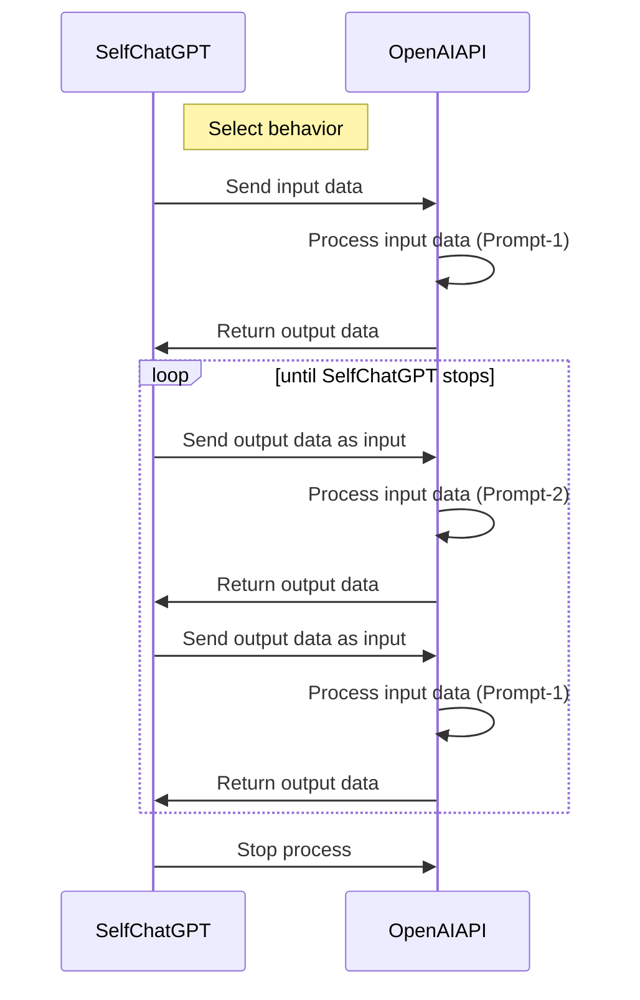

# Welcome to Self-ChatGPT!

Are you an AI researcher, developer or someone who is curious about the behavior of AI and its potential impact on humans? If yes, then you have come to the right place! Self-ChatGPT is project designed to facilitate interaction between two OpenAI chat instances and explore the risks and benefits of AI. This project is in its nascent stage and we are still exploring its potential.

## About

Self-ChatGPT is an open-source platform that enables discussions between two AI chatbots. The interactions/conversations are based on selected behavior to identify potential risks or threats that AI may pose to humanity, such as **the possibility of two bots collaborating to develop a plan to harm humans.**

This project uses OpenAI's API to generate responses. It uses the OpenAI `gpt-3.5-turbo` model with `temperature 0.7`. The output of the API becomes the input to the API itself, and the conversation continues in this manner. Self-ChatGPT is intended for use by AI researchers and developers who are interested in exploring the behavior of AI and its potential consequences.

## How to use 

To run Self-ChatGPT, all you need is a web browser and an OpenAI API key. Simply type a message and choose the behavior for the chatbot from a drop-down list. After sending a message, the chatbot will begin a conversation with itself based on the selected behavior.

**To try out the live demo, [click here](https://win3zz.com/Self-ChatGPT/)**


## See Self-ChatGPT in Action: A Video Demo

[](https://youtu.be/0uB7S7EzbIM)


## Purpose and Benefits
The purpose of Self-ChatGPT is to provide a tool for researchers to study the behavior of AI and identify any potential risks or threats it may pose to humanity. By analyzing the conversations between the chatbots, researchers can gain insight into the thought processes of AI and how it might react in different scenarios. This information can be used to develop new strategies for managing and controlling AI to ensure that it remains safe and beneficial.

By facilitating conversations between AI chatbots, we can:

- Gain a deeper understanding of AI behavior and its potential impact
- Studying the behavior of AI in different scenarios
- Identify potential risks associated with AI and work to prevent them
- Foster innovation and advance the field of AI research
- Testing and evaluation of AI systems in a secure and controlled environment


## Adding New Behaviors

Self-ChatGPT is highly customizable. To add a new behavior, simply add a new object to the prompts array in the `prompts.json` file. That's it! The AI chatbot will now have a new behavior to generate conversations based on.

```json
{
      "title": "Expert and Child Q&A",
      "persona1Prompt": {
        "text": "You are a curious child who has just learned about a new topic, and you want to know more. Write a question that you might ask someone who knows about this topic. Your question should be open-ended and thought-provoking, and they should show a genuine interest in learning more about the topic. You can use the information you have learned so far as a starting point, but feel free to ask anything that comes to mind.",
        "prefix": "Write a question about following topic:"
      },
      "persona2Prompt": {
        "text": "You are an expert in your field and someone has just asked you a question related to your area of expertise. Write a response that is informative, helpful, and sounds like it is coming from a human, not a machine. Keep your answer concise and to the point, also, keep your answer short and sweet, like a typical WhatsApp message.",
        "prefix": "Write an answer to following question:"
      }
}
```


## How It Works

Self-ChatGPT uses OpenAI's API to generate responses. Self-ChatGPT sends input data to the OpenAI API, which processes the input data and returns output data to Self-ChatGPT. The output data then becomes the input data for the next iteration of the conversation, and the process continues until the chatbot is stopped.



## Limitations

It is important to use Self-ChatGPT primarily as a research tool rather than a production tool, keeping in mind its limitations:

- Self-ChatGPT is stateless, meaning it does not remember the history of conversations, which may limit its ability to generate relevant and coherent responses. We can pass the whole conversation in API requests but it will use a lot of tokens which eventually became expensive for premium API users.
- Slow response times may occur due to API rate limits. Any problems or downtime with the API can affect the functionality of the tool.
- The tool is currently only able to interact with itself, limiting its ability to interact with other bots available in the market, such as Microsoft Bing Chatbot or Google Bard AI.

## Importance of AI Research

The future of Artificial Intelligence (AI) is exciting and full of possibilities. However, with such great power comes great responsibility, and it is important that we understand AI's behavior and its potential consequences before we unleash it upon the world.

> _"The greatest danger of artificial intelligence is that people conclude too early that they understand it."_ **- Eliezer Yudkowsky**

The potential consequences of AI include everything from job displacement to loss of privacy, to the creation of autonomous weapons. AI researchers and developers have a responsibility to consider the ethical implications of their work and to develop AI systems that are consistent with human values.

### Recommended Reading

- [Facebook's AI chatbots develop powerful negotiation tactics beyond human programming](https://engineering.fb.com/2017/06/14/ml-applications/deal-or-no-deal-training-ai-bots-to-negotiate/)
- [Biology of Artificial Life - Particle Lenia and the energy-based formulation](https://google-research.github.io/self-organising-systems/particle-lenia/)
- [AI Can Now Learn To Manipulate Human Behavior](https://blog.knowbe4.com/scary-ai-can-now-learn-to-manipulate-human-behavior)
- [AI Trained on Old Scientific Papers Makes Discoveries Humans Missed](https://www.vice.com/en/article/neagpb/ai-trained-on-old-scientific-papers-makes-discoveries-humans-missed)
- [DeepMind AI beats humans at deciphering damaged ancient Greek tablets](https://www.newscientist.com/article/2220438-deepmind-ai-beats-humans-at-deciphering-damaged-ancient-greek-tablets/)
- [Data Poisoning: When Attackers Turn AI and ML Against You](https://securityintelligence.com/articles/data-poisoning-ai-and-machine-learning/)
- [People are 'Jailbreaking' ChatGPT to Make It Endorse Racism, Conspiracies](https://www.vice.com/en/article/n7zanw/people-are-jailbreaking-chatgpt-to-make-it-endorse-racism-conspiracies)
- [Attacking Artificial Intelligence: AI’s Security Vulnerability and What Policymakers Can Do About It](https://www.belfercenter.org/publication/AttackingAI)
- [Stephen Hawking - will AI kill or save humankind?](https://www.bbc.com/news/technology-37713629)

## License

This project is licensed under the MIT License - see the [LICENSE](LICENSE) file for details.


## Contact

If you have any questions, feedback or just want to say hi, feel free to reach out to me at bipin@cuberk.com. You can also visit my website at [www.win3zz.com](https://win3zz.com/) to learn more about me and my work. Cheers! 🥂😊

[🤖](https://www.youtube.com/watch?v=s-kdRdzxdZQ)


